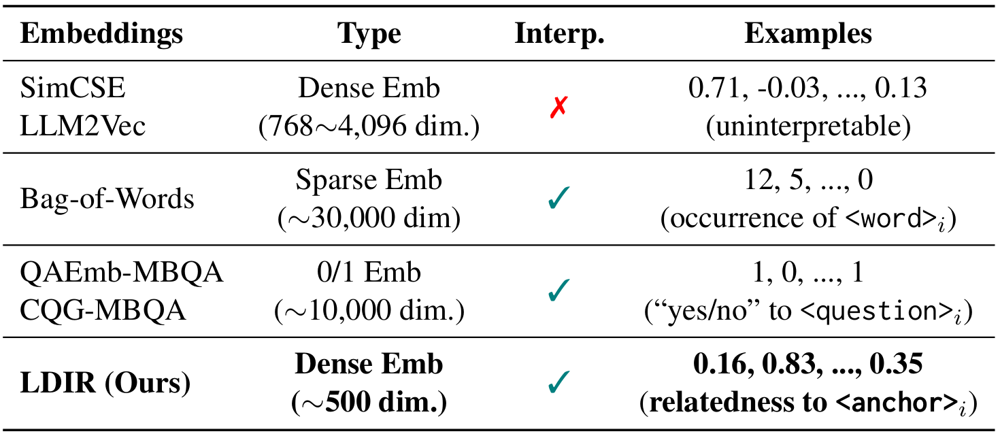
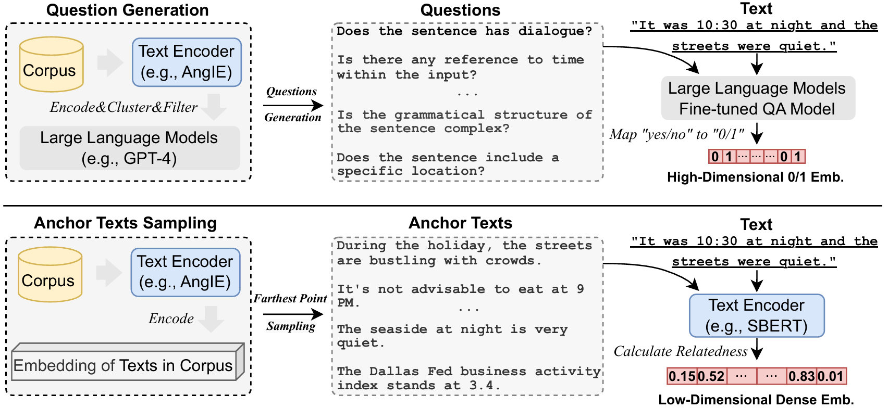

# LDIR: Low-Dimensional Dense and Interpretable Text Embeddings with Relative Representations 🚀

This repository contains the code and pre-trained models for our paper [LDIR: Low-Dimensional Dense and Interpretable Text Embeddings with Relative Representations](https://arxiv.org/abs/2505.10354).

**LDIR** ( **L**ow-Dimensional **D**ense **I**nterpretable Text Embeddings with **R**elative Representations) is a novel text embedding method that balances **semantic expressiveness**, **interpretability**, and **computational efficiency**. Unlike traditional dense embeddings (e.g., SimCSE, LLM2Vec) or sparse interpretable methods (e.g., Bag-of-Words, QAEmb-MBQA), LDIR uses **relative representations** to anchor texts, enabling **low-dimensional dense embeddings** while preserving traceable semantics.  

<div align="center">
  
  <br>
</div>

## New 🌟
- [2025/05/15] 🔥 Our paper has been accepted to ACL Finding!
- [2025/04/28] We released our paper and code repo. 

## Key Features ✨

- **🌐 Low-Dimensional & Dense**: Achieves strong performance with **200–500 dimensions** (vs. 10k+ in baselines).  
- **🔍 Interpretable Embeddings**: Each dimension reflects semantic relatedness to **automatically sampled anchor texts**.  
- **📊 State-of-the-Art Performance**: Outperforms interpretable baselines (e.g., +4.2 Spearman on STS, Retrival, Clustering tasks) and rivals black-box models.  
- **⚡ Efficient Sampling**: Anchor texts selected via **farthest point sampling (FPS)** for maximal diversity.  
- **🛠️ Flexible Backbones**: Compatible with encoders like SBERT, ModernBERT, and AngIE.  
- **🧠 Low Cognitive Load**: Binarized embeddings achieve **5–10 cognitive load** while maintaining performance.  

---

## Framework 🛠️

<div align="center">
  
  <br>
</div>

### Workflow  

1. **Anchor Sampling**: Extract diverse anchor texts from a corpus using FPS.  
2. **Relatedness Calculation**: Compute similarity scores between input text and anchors via a pretrained encoder (e.g., AngIE).  
3. **Embedding Generation**: Construct low-dimensional dense embeddings from scores.  

---

## Getting Started 🚦  

1. **Clone the repository**:  
```bash
git clone https://github.com/yourusername/LDIR.git
cd LDIR
```

2. **Set up the environment**:  

Primarily, we need to set up a conda environment:

```bash
# Create and activate a conda environment
conda create -n ldir python=3.9
conda activate ldir

# Install dependencies
pip install -r requirements.txt
```

If you need to evaluate cognitive load score for the STS tasks, please uninstall the METB package and install the benchmark package modified by [CQG-MBQA]([dukesun99/CQG-MBQA](https://github.com/dukesun99/CQG-MBQA)):	

```cmd
# Install modified MTEB for cognitive load evaluation (optional)
pip uninstall mteb -y
git clone https://github.com/dukesun99/CQG-MBQA.git
cd CQG-MBQA/mteb
pip install .
```

3. **Using generic anchors**:  

Our anchor texts are collected from the general dataset MEDI2. You can also sample anchors from MEDI2 by following these steps (❗please ensure you have at least 70GB of disk space available):

```cmd
cd data
git lfs install
git clone https://huggingface.co/datasets/GritLM/MEDI2
cd ..
python utils/preprocess-medi2.py
```

Additionally, we provide two sets of anchor texts in `./data/medi_text_100low/FPS`. You can directly use these anchor texts to validate the quality of interpretable embeddings across various domains, as shown in `quick_start.py`:

```python
from src.anchor_sim_model import cos_simi_model
import json
import os

dirname = os.path.dirname(__file__)

anchor_file = os.path.join(dirname, "./data/medi_text_100low/FPS/500.json")
with open(anchor_file, "r") as f:
    anchors_dict = json.load(f)

anchors_list = []
anchors_dict_keys = list(anchors_dict.keys())
for i in anchors_dict_keys:
    anchors_list.append(anchors_dict[i])

encoder_model = cos_simi_model("WhereIsAI/UAE-Large-V1", anchors=anchors_list)

example_documents = [
    "This is a test document", 
    "This is another test document"
]
# Perform inference
embeddings = encoder_model.encode(example_documents) 
```

4. **Building personalized anchor texts**:  

LDIR allows you to construct your own anchor texts with only a small amount of text data. You can replace the corpus path in `sample_FPS.py` and run it to sample data from your dataset using FPS. Alternatively, you can directly add the desired texts to the anchor text file, as LDIR supports flexible expansion of embedding dimensions. Below is the recommended format for the aforementioned files:

`Corpus`: A list of text data, saved as a JSON file.

`Anchor text`: A dictionary composed of (number, anchor text) pairs, where the number serves only as an identifier, saved as a JSON file.

5. **Evaluate on MTEB benchmark**:  
```bash
python single_evaluation.py \
  --seed 224 \
  --task_type STS \
  --sample_type FPS \
  --num_anchors 500 \
  --model_name_or_path WhereIsAI/UAE-Large-V1 \
  --batch_size 16384
```

---

## Citation 📜  
If you find this repository useful for your research, please consider citing our paper:  
```bibtex
@article{wang2025ldir,
  title={LDIR: Low-Dimensional Dense and Interpretable Text Embeddings with Relative Representations},
  author={Wang, Yile and Shen, Zhanyu and Huang, Hui},
  journal={arXiv preprint arXiv:2505.10354},
  year={2025}
}
```

---

## License 📄  
This project is licensed under the MIT License. 
